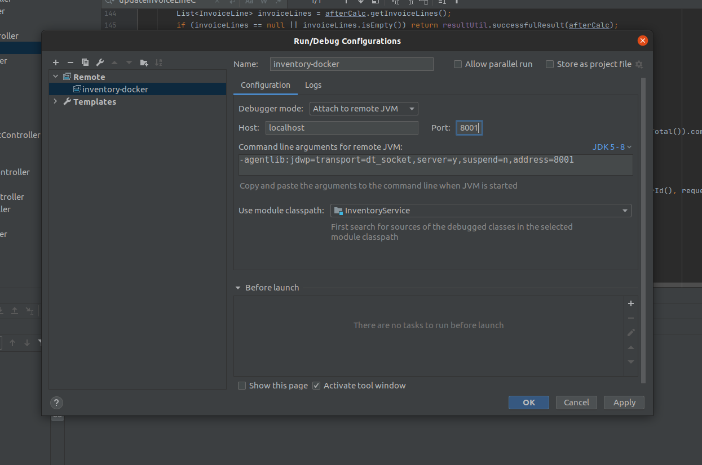

# Environment Setup using Docker/Docker-Compose

# Table of Contents
1. [Pre Requisites](#prereqs)
1. [Requirements](#reqs)
1. [Overview](#overview)
1. [Find Host IP address](#ip)
1. [Replace localhost](#localhost)
1. [Env file](#env)
1. [Hostname/IP resolution alternatives](#ip_alternatives)
1. [Point Services to use host interface](#host_interfaces)
1. [Building](#building)
1. [Running](#running)
1. [Debugging](#debugging)


## Pre Requisites: <a name="prereqs"> </a>

- NVM/NPM installed

## Requirements: <a name="reqs"> </a>
- Docker (v19+)
- Docker Compose (v1.27.4+)


## Overview: <a name="overview"> </a>
This document is designed to guide the user through setup and deployment of the required infrastructure for Treez using Docker.
The hints and inventory services instructions are also included, but can be excluded, if you want to run then through IntelliJ IDEA. 

This will be broken down into the following steps

- Find the IP address of your host system
  - this is needed because calls to localhost will fail from a docker container, as the services are not hosted in a single container
- Replace localhost occurrences with the host IP address or use a domain in hosts
- point volume mounts to  local dev code
- build and deploy docker containers


## Find the IP address of your host system: <a name="ip"> </a>
run the following command on linux/mac
```
 hostname -I |awk '{print $1}'
```

and note it down.

if this doesn't work, you can use `ifconfig` or `ip` and find your local ip address.

Note: you are not looking for localhost, but you can use either the wlan/ethernet IP, or docker-bridge IP

##  Replace localhost with host interface IP: <a name="localhost"> </a>
- Replace the instances of localhost in DispensaryPortal with the hostname from above
   - config.php
        - DB_SERVER
        - HINTS_LOCAL_SERVER replace `$_SERVER[SERVER_NAME]` with the IP address
        - HINTS_CLOUD_SERVER replace `$_SERVER[SERVER_NAME]` with the IP address

   - hints.properties


## Update env file <a name="env"> 

Update the `dockerfiles/.env` file with the IP address you just found


## Hostname/ip resolution alternatives: <a name="ip_alternatives"> </a>
in the first step, we replaced `localhost` with the IP address of one of our host interfaces.
  This was done so that the containers can communicate with each other, but also so that the URLS presented to the browser will work.
  The developer accessing the DispensaryPortal is not on a container, and will not be able to use container/docker networking, and therefore
  the XHR requests sent from the browser should be sent to either `localhost` on the host, or the host interface IP address, or the docker bridge interface IP address.
  
  This adds complexity, in deciding whether a service URL should be a docker network address (eg `db` or `hints`) or localhost, or the host interface.  To make things easier,
  the docker services are mostly set to use the host interface IP address.  This also allows the same configuration of Hints and Inventory to be deployed via IntelliJ IDEA or docker.
  
  If it is known that a service will only be communicating between docker containers, we can use the image network name. 
  For instance, the Hints and Inventory services can update their jdbc connection strings to `jdb:mysql://db:3306` instead of `jdb:mysql://IP_ADDRESS:3306`  
  


## Pointing Services to use host network interface: <a name="host_interfaces"> </a>

There are a few additional changes needed for the Hints and Inventory Service to be run inside docker

*These need to be chaned in the respective service source code directories*


- Update the `localhost` urls to use the host interface IP address (or docker networking as explained above)
  - InventoryService 
      - WebHookConfig
      - application.properties spring datasource
         -  the datasource may need `&useSSL=false` as ssl hasn't been enabled on the mysql container at the moment.
  - HintsService
    - hints.properties, db.crm.url jdbc connection string


# Building: <a name="building"> </a>
To make life easier, the docker-compose commands are aliased to the `treez` command. In order to load these, run the following, or append it to your .bashrc file.

```
source dockerfiles/source 
```


You will need to bootstrap the first source build in docker, (we should eventually move this to ECR instead)
In order to build the necessary dependencies. Note that if you are modifiying any of these dependencies, you will need to build this again.

run

```
treez_dependencies
```

After this finishes, you should build the rest of the services, and then you are ready to start them.

To build the services run

```
treez build
```


If you just want to rebuild a specific service, run

```
treez build ${serviceName}
```

for instance


```
treez build inventoryservice
```


# Running: <a name="running"> </a>


To run everything, use

```
treez up
```

to stop everything use
```
treez down
```

to start a specific service use 
```
treez up ${serviceName}
```

for instance 
```
treez up inventoryservice
```


## Debugging: <a name="debugging"> </a>

For Java services, you can attach a remote debugger from IntelliJ. 
Since remote debugging involves connecting to a port, they must be unique between containers to avoid collision

The following table describes the exposed ports for each container

| Service  |      debugging port    |
|----------|:-------------:|
| inventory |8001 |
| hints |    8002   |

You will need to create a new Remote Debugging configuration in intellij, and point the port to the relevant debugging port (see screenshot)

 


for more information, see this blog post:

https://blog.jetbrains.com/idea/2019/04/debug-your-java-applications-in-docker-using-intellij-idea/